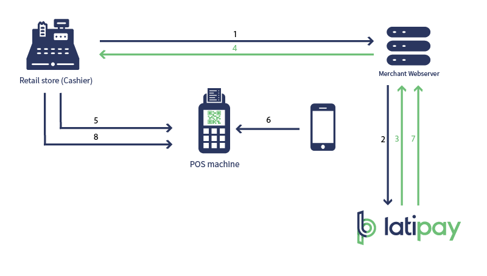

[Download PDF](/pdf/Merchant Hosted API Offline.pdf)

This API will return `QR code` in a diagramatic format along with the Transaction and Payment Interfaces. 

## How it works?

 

1. To process a transaction, customers select `Wechatpay` or `Alipay` as a payment method.

2. Merchant will initiate the request to Latipay with the transaction details (Amount, Product etc).

3. Latipay will respond to the Merchant with the '`Host_URL` & `Nonce` (equivalent of an ID)'.

4. Merchant will process the URL / Nonce to generate the QR Code.

5. Then, QR Code is displayed on the Terminal for cutsomer to scan.

6. Customer scans the QR Code with Alipay/Wechat APP to complete the payment.

7. Upon the successful payment completion, Latipay will notify the Merchant with 'Callback URL'. 

8. Terminal will pop up with the results on the monitor whether the transaction is approved or declined.


## API Parameters


### STEP 1 - Latipay Transaction Interface  
```
POST https://api.latipay.net/v2/transaction
```
  
#### Parameters:    


| Name  | Type  | Description | Nullable | 
|------------- |---------------| -------------| -------------|
| user_id| String| The user account you want to use to process the transaction.| No|
| wallet_id| String| The ID of the wallet you want to use.| No|
| amount| String| A decimal amount.| No|
| merchant_reference| String| A field for identifying your transaction.| No|
| payment_method| String| Payment method options are `alipay` and `wechat`.| No|
| return_url| String| The URL of the landing page where Latipay will return the customer after payment, but it doesn't work in `in-store` situation. The value is `""` | No|
| callback_url| String| The URL of the callback address the transaction notification is sent after payment.| No|
| ip| String| The IP address of the customer.| No|
| version| String| The latest version of the platform. must be `"2.0"`| No|
| product_name| String| The name of the product or service being sold.| YES|
| host_type| String| must be `"1"`, for [#Payment Interface](#STEP-2-Payment-Interface) to return `QR code picture` in base64 | No|
| signature| String| The SHA-256 HMAC API signature.| No|


#### Example

```json
{
  "signature": "14d5b06a2a5a2ec509a148277ed4cbeb3c43301b239f080a3467ff0aba4070e3",
  "wallet_id": "W00000001",
  "amount": "120.00",
  "user_id": "U000334333",
  "merchant_reference": "dsi39ej430sks03",
  "return_url": "",
  "callback_url": "https://merchantsite.com/confirm",
  "ip": "122.122.122.1",
  "version": "2.0",
  "product_name": "Pinot Noir, Otago",
  "payment_method": "alipay",
  "host_type" : "1"
}
```

#### SHA-256 HMAC Signature

```
message: user_id + wallet_id + amount + payment_method + return_url + callback_url
secret: api_key
```

#### Example Signature 

```
message: U000000001W000000010.01alipayhttp://merchant.com/callback
secret: 111222333

signature: cf3cf508b7b245be8921e324d5cb588598c36a07ffc62f998b90ab0e355f2d78
```

#### Response


| Name  | Type  | Description | 
|------------- |---------------| -------------| 
|host_url | String | The url for request a QR code picture. The nonce should be appended to the end. | 
|nonce | String | The transaction nonce must be appended to the host_url URL. | 
|signature | String | The SHA-256 HMAC API signature. | 

#### Example

```json
{
  "host_url": "https://api.latipay.net/merchanthosted/gatewaydata",
  "nonce": "7d5a88119354301ad3fc250404493bd27abf4467283a061d1ed11860a46e1bf3"
  "signature": "14d5b06a2a5a2ec509a148277ed4cbeb3c43301b239f080a3467ff0aba4070e3",
}
```

#### Signature in Response
For security reasons, we highly recommend you verify the signature in the response.

```
message: nonce + host_url
secret: api_key
```

---

### STEP 2 - Payment Interface

```
POST {host_url}/{nonce}
```

#### Example

```
https://api.latipay.net/merchanthosted/gatewaydata/7d5a88119354301ad3fc250404493bd27abf4467283a061d1ed11860a46e1bf3
```

#### Response

| Name  | Type  | Description | 
|------------- |---------------| -------------| 
|code | Integer | The response code of payment, `0` or [Error Code](https://doc.latipay.net/v2/error-code.html), 0 means no error happened.
|message | String | The response message of payment interface.
|data | Object | Contains `QR code picture` and order information.

the `data` object

| Name  | Type  | Description | 
|------------- |---------------| -------------| 
| order_id | String | A unique transaction identifier generated by Latipay. |
| nonce | String | A unique transaction nonce generated by Latipay. |
| payment_method | String | Payment method options are alipay and wechat. |
| amount | String | A decimal amount. |
| amount_cny | String | A decimal amount. |
| currency | String | The currency code of the transaction. |
| product_name | String | The name of the product or service being sold. |
|organisation_id | Integer | The merchant id which is used to process the transaction. |
|org_name | String | The merchant's name |
|user_id | String | The user account which is used to process the transaction. |
|user_name | String | The user account's name |
|wallet_id | String | The user wallet account which is used to process the transaction. |
|wallet_name | String | The wallet account's name |
|qr_code | String | The QR code picture |
|qr_code_url | String | The QR code text version, you can generate QR code picture with it. |
|currency_rate | String | The rate which is used to the transaction. |
|merchant_reference | String | A field for identifying your transaction. |
|signature | String | The `SHA-256 HMAC` API signature. |

#### Example

```json
{
    "code": 0,
    "message": "SUCCESS",
    "data": {
        "order_id": "20180112000003",
        "nonce": "fd270820180112103849a19380c7300c425898780b3d0b1fbc",
        "payment_method": "wechat",
        "amount": 0.01,
        "amount_cny": 0.05,
        "currency": "AUD",
        "product_name": "产品中文",
        "organisation_id": 695,
        "organisation_name": "126Emai",
        "user_id": "U000000266",
        "user_name": "04_oliver",
        "wallet_id": "W000000329",
        "wallet_name": "AUD_01",
        "qr_code": "data:image/png;base64,iVBORw0KGgoAAAANSUhEUgAAAMgAAADICAYAAACtWK6eAAAEzUlEQVR42u3dS27cQAwE0Ln/pZMTGDBgDVlFPQLZaWBJzadFpT+ff0qpH+vjFSgFiFKAKAWIUoAoBYhS3UA+n0/Mv18/0C9/2/hsf3nev7yDrd8mvHtAAAEEEEAAAQQQQAABBJBoICPJwR9e9MSAPP1sE8+7dS+NfQUIIIAAAggggAACCCCAAFIN5Olm27ru6SZPSrEm7iUpaQQEEEAAAQQQQAABBBBAAAEkAMiV6SJJCV06akAAAQQQQAABBBBAAAEEEECKUqzGaSAT0za2ki1AAAEEEEAAAQQQQAABBBBAvgjkbS9w4u+mY7UeBBBAAAEEEEAAAQQQQAABJABI0lQO1925ztajgLgOEEBcBwggrgMEENcB8uIzCtPXYEw821bKVtUngAACCCCAAAIIIIAAAgggbUAm1iRcnlay1ZTpiWTChwgQQAABBBBAAAEEEEAAASQaSOMRBhO/3RrM9CMWJhK6b94LIIAAAggggAACCCCAAAJINJCkZCsJ3JWdFbeuSz2yARBAAAEEEEAAAQQQQAABpA5IelpzZcdEzfv8cwACCCCAAAIIIIAAAggggNQAedsB91tp0uUUq71fAAEEEEAAAQQQQAABBBBAYoBsJTNJCdMEhulk5hquqJgXEEAAAQQQQAABBBBAAAFk8n/SJxKIK03euDviFq7UzTsAAQQQQAABBBBAAAEEEEBigEwnBs2JS2MTbR1/kJR6AgIIIIAAAggggAACCCCA1AC5stlB+ll8SSnblaTsTMwLCCCAAAIIIIAAAggggADSkjCl7/jXCH0rGdxCAwgggAACCCCAAAIIIIAAAkjANIut9OzxAQxaT5M01eRMigUIIIAAAggggAACCCCAAJLY0Fs79F1pyq0mb0/UAAEEEEAAAQQQQAABBBBAXgVkK4naevlX1mUkJXTfvD9AAAEEEEAAAQQQQAABBJAYIJeTisvJVuN7OXM+CCCAAAIIIIAAAggggAACyCSQLUjpzTa9mcB24yc070TyBggggAACCCCAAAIIIIAAEgMkaeAaz/tLeo705K0yxQIEEEAAAQQQQAABBBBAAJkEkv7yG481SGqE9F0jE5I8QAABBBBAAAEEEEAAAQSQGCBbaU1SqtOY/mjy554NEEAAAQQQQAABBBBAAAEkBsjW1Iatw+ev7CCYvv6laVoOIIAAAggggAACCCCAAAJIDJD0Bkw/B7FxLUn6zooTfQoIIIAAAggggAACCCCAABIJ5PIajK2kDLiuMQIEEGMECCDGCBBAAAEEEEDqUqytShrg9CZKnxoy8YEGBBBAAAEEEEAAAQQQQACpBrI1wG/bxKBx3U16yvbY2AACCCCAAAIIIIAAAggggCQDSUqntqYxSMDyU6yn7g8QQAABBBBAAAEEEEAAAaQOSOOZgt98qZNNnv7RSf+IAQIIIIAAAggggAACCCCAAFIEZGKaReOUmfRjF9bOKAQEEEAAAQQQQAABBBBAAHkrkMYzBSfSs63pIlIsQAABBBBAAAEEEEAAAQSQACATDdiYuDQmOEnnTQICCCCAAAIIIIAAAggggAAynEpc3lBhKxncSveSUrGn7gUQQAABBBBAAAEEEEAAASQGiFJvL0CUAkQpQJQCRClAlAJEKUCUqq7/Vhpz81YibhcAAAAASUVORK5CYII=",
        "qr_code_url": "weixin://wxpay/bizpayurl?pr=ZObbdsW",
        "currency_rate": "5.13710",
        "merchant_reference": "",
        "signature": "cf56a6bbe1aa42e1c273c4d7fe6233f70a6b10ba39e88938b13469f3315e4c41"
    }
}
```

#### SHA-256 HMAC Signature

```
message: amount=1.00&amount_cny=5.00&currency=NZD&currency_rate=5.29930&merchant_reference=dsi39ej430sks03&nonce=7d5a88119354301ad3fc250404493bd27abf4467283a061d1ed11860a46e1bf3&order_id=20170829-alipay-3990527237343&organisation_id=18&org_name=Latipay&payment_method=alipay&product_name=test&qr_code=https://qr.alipay.com/bax03286h4vlfpxldgwq4035&type=Online&user_id=U000000051&wallet_id=W000000037&wallet_name=aud01
secret: api_key
```

---

### STEP 3 - Payment Result Asynchronous Notification

This is a payment result notification sent by Latipay to merchants after the payment is done successfully. There is a re-try mechanism with the notification to ensure the notification could be delivered to the merchant.


```
POST merchant's callback_url
Content-Type: application/json
```

#### Parameters:    

| Name  | Type  | Description | 
|------------- |---------------| -------------|
| transaction_id | String | A unique transaction identifier generated by Latipay. | 
| merchant_reference | String | A field for identifying your transaction. | 
| currency | String | The currency code of the transaction. |
| amount | String | A decimal amount. |
| payment_method | String | The payment method used. Possible values are alipay and wechat. |
| status | String | The status of the transaction. Possible values are: pending, paid, or failed. |
| pay_time | String | Show the payment time of the transaction order. |
| signature | String | The `SHA-256 HMAC` API signature. |  

#### Example input

```json
{
  "signature": "14d5b06a2a5a2ec509a148277ed4cbeb3c43301b239f080a3467ff0aba4070e3",
  "transaction_id": "20170707-wechat-3473511594933",
  "merchant_reference": "dsi39ej430sks03",
  "currency": "AUD",
  "amount": "120.00",
  "payment_method": "wechat",
  "status": "paid",
  "pay_time": "2017-07-07 10:53:50"
}
```


#### SHA-256 HMAC Signature
Merchant backend needs to validate the signature for protecting against malicious requests.

```
message: merchant_reference + payment_method + status + currency + amount
secret: api_key
```

#### Expected the text "sent" in Response's body

```
sent
```

### STEP 4 - Payment Result Interface
All customers can send requests to query payment status with merchant order id(that should be unique id for the merchant) as merchant_reference by HTTP GET request.

```
GET https://api.latipay.net/v2/transaction/{merchant_reference}
```

#### Parameters

| Name  | Type  | Description | 
|------------- |---------------| -------------|
| user_id | String | The user account you want to use to process the transaction. |
| signature | String | The `SHA-256 HMAC` API signature. |

#### SHA-256 HMAC Signature

```
message: merchant_reference + user_id
secret: api_key
```

#### Example

```
GET https://api.latipay.net/v2/transaction/1289323A122DB?user_id=U000334333&signature=14d5b06a2a5a2ec509a148277ed4cbeb3c43301b239f080a3467ff0aba4070e3
```

#### Response

| Name  | Type  | Description | 
|------------- |---------------| -------------|
| transaction_id | String | A unique transaction identifier generated by Latipay. |
| merchant_reference | String | A field for identifying your transaction. |
| currency | String | The currency code of the transaction. |
| amount | String | A decimal amount. |
| payment_method | String | The payment method used. Possible values are alipay and wechat. |
| status | String | The status of the transaction. Possible values are: pending, paid, or failed. |
| pay_time | String | Show the payment time of the transaction order. `UTC/GMT+08:00`| 
| signature | String | The `SHA-256 HMAC` API signature. |

#### Example Response

```json
{
  "transaction_id": "20170707-wechat-3473511594933",
  "merchant_reference": "dsi39ej430sks03",
  "currency": "AUD",
  "amount": "120.00",
  "payment_method": "wechat",
  "status": "paid",
  "pay_time": "2017-07-07 10:53:50"
  "signature": "14d5b06a2a5a2ec509a148277ed4cbeb3c43301b239f080a3467ff0aba4070e3",
}
```

#### Signature in Response
For security reasons, we highly recommend you verify the signature in the response.

```
message: merchant_reference + payment_method + status + currency + amount
secret: api_key
```

#### Example Signature

```
message: dsi39ej430sks03alipaypaidNZD120.00
secret: 111222333
signature: 840151e0dc39496e22b410b83058b4ddd633b786936c505ae978fae029a1e0f1

```