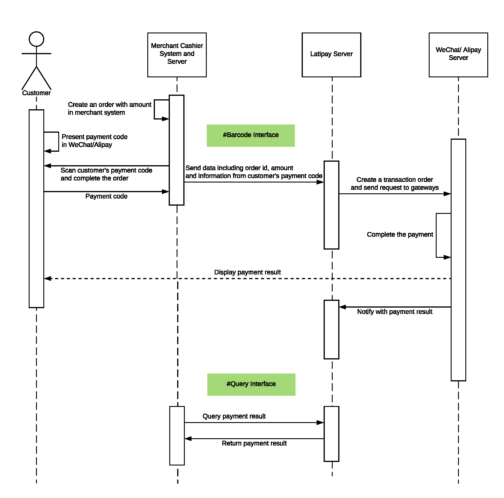
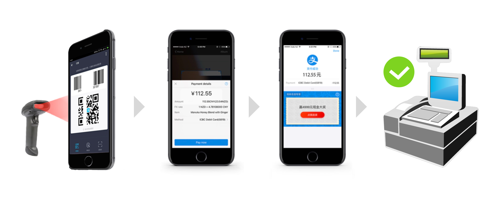
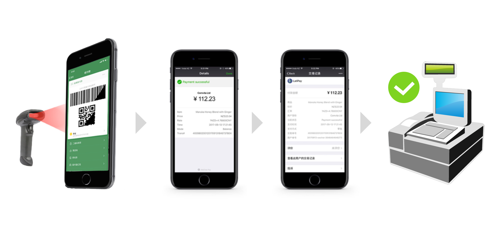

[API Playground](http://doc.latipay.net/api-console/barcode.html)

<p class="tip">Tips: Get your `Wallet ID`, `User ID` and `API key` via <a href="https://merchant.latipay.net/account" target="__blank">Latipay Merchant Portal</a> > Account > Show hidden values
Tips: Create a minimum amount product (e.g. $ 0.01 NZD/AUD) for testing.</p>

## How it works?




## Payment Scenarios

Alipay


WeChat Pay


## API Details

### 1 - Latipay Transaction Interface

```
POST https://api.latipay.net/barcode
Content-Type: application/json;charset=UTF-8
```

[API Playground](http://doc.latipay.net/api-console/barcode.html?api=/barcode)

Demo

```
curl \
-X POST \
-H "Content-Type: application/json;charset=UTF-8" \
-d '{
  "user_id": "U000000013",
  "wallet_id": "W000000023",
  "amount": "0.05",
  "pay_code": "1234567890",
  "signature": "fdaa4b9763d77cb034ffd9691324eda4ae5e845487f794c92a48db338298fde3"
}' \
https://api.latipay.net/barcode
```

* <strong>Parameters</strong>

| Name  | Type  | Description | Nullable |
|------------- |---------------| -------------| -------------|
|user_id | String | The Latipay user account which is using for processing the transactions. | NO |
|wallet_id | String | The wallet ID that using for online transactions.  | NO
|amount | String | A decimal amount. | NO
|merchant_reference | String | A `unique id` identifying the order in Merchant's system. | NO
|pay_code | String | Customer's payment code which displayed in Wechat app or Alipay app. | NO
|signature | String | The `SHA-256 HMAC` API signature. | NO

Example

```json
{
  "user_id": "U00001534",
  "wallet_id": "W00000001",
  "amount": "0.05",
  "pay_code": "134588558514585062",
  "signature": "e66d54f711bc6a1dde59838c8b0de73ccc8b025a2ae65ae878216f010a05f599"
}
```

* <strong>SHA-256 HMAC Signature</strong> [Try your signature online](https://jsfiddle.net/tonnyLTP/wj36tey4/45/)

Rearrange all parameters alphabetically (except parameters with value of `null` or `empty` string) and join them with `&`, and concat the value of `api_key` in the end.

JS code example:

```js
  Object.keys(data)
    .filter(item => data[item] != null && data[item] != undefined && data[item] !== '')
    .sort()
    .map(item => `${item}=${data[item]}`)
    .join('&')
    .concat(api_key)
```

Example

```
Message: amount=0.05&pay_code=134588558514585062&user_id=U00001534&wallet_id=W00000001111222333
SecretKey: 111222333

Signature: e66d54f711bc6a1dde59838c8b0de73ccc8b025a2ae65ae878216f010a05f599
```

* <strong>Response</strong>

```json
{
  "code": 0,
  "message": "SUCCESS",
  "order_id": "2018071000000033"
}
```

| Name  | Type  | Description  |
|------------- |---------------| -------------|
| order_id | String | A unique transaction identifier generated by Latipay. |


### 2 - Payment Result Interface
All customers can send requests to query payment status with merchant order id(that should be `unique id` for the merchant) as merchant_reference by HTTP GET request.

```
GET https://api.latipay.net/v2/transaction/{merchant_reference}
```

[API Playground](http://doc.latipay.net/api-console/barcode.html?api=/v2/transaction/{merchant_reference})


#### Parameters

| Name  | Type  | Description | Nullable |
|------------- |---------------| -------------| -------------|
| merchant_reference | String | A `unique id` identifying the order in Merchant's system. | NO |
| user_id | String | The user account you want to use to process the transaction. | NO |
| is_block | Int | Optional parameter, `1` means the http request use long poolling mechanism, the timeout is 180s. | YES |
| signature | String | The `SHA-256 HMAC` API signature. | NO |

* <strong>SHA-256 HMAC Signature</strong> [Try your signature online](https://jsfiddle.net/tonnyLTP/wj36tey4/45/)

Rearrange all parameters alphabetically (except parameters with value of `null` or `empty` string) and join them with `&`, and concat the value of `api_key` in the end.

JS code example:

```js
  Object.keys(data)
    .filter(item => data[item] != null && data[item] != undefined && data[item] !== '')
    .sort()
    .map(item => `${item}=${data[item]}`)
    .join('&')
    .concat(api_key)
```

```
Message: merchant_reference=6000324&user_id=U000000013111222333
SecretKey: 111222333
Signature: 58f93f458880120d650611f2452917a25a39edc2f5e3a03baac73a7a49bc81f4
```

#### Example

```
GET https://api.latipay.net/v2/transaction/6000324?user_id=U000000013&signature=58f93f458880120d650611f2452917a25a39edc2f5e3a03baac73a7a49bc81f4
```

#### Response

| Name  | Type  | Description |
|------------- |---------------| -------------|
| merchant_reference | String | A `unique id` identifying the order in Merchant's system. |
| currency | String | The currency code of the transaction. |
| amount | String | A decimal amount. |
| payment_method | String | The payment method used. Possible values are alipay and wechat. |
| status | String | The status of the transaction. Possible values are: pending, paid, or failed. |
| pay_time | String | Show the payment time of the transaction order. `UTC/GMT+08:00`|
| order_id | String | A unique transaction identifier generated by Latipay. |
| signature | String | The `SHA-256 HMAC` API signature. |

#### Example Response

```json
{
  "merchant_reference": "6000324",
  "currency": "AUD",
  "amount": "120.00",
  "payment_method": "wechat",
  "status": "paid",
  "pay_time": "2017-07-07 10:53:50",
  "order_id": "201839263686323",

  "signature": "14d5b06a2a5a2ec509a148277ed4cbeb3c43301b239f080a3467ff0aba4070e3",
}
```

#### Signature in Response
For security reasons, we highly recommend you verify the signature in the response.

```
message: merchant_reference + payment_method + status + currency + amount
secret: api_key
```

#### Example Signature

```
message: 6000324alipaypaidNZD120.00
secret(your api_key): 111222333

signature: 3149d48405bf8782b8b4ae816a91744c5eb6d4a0293f8bb9bc8f0d9f29fdfb40

```
