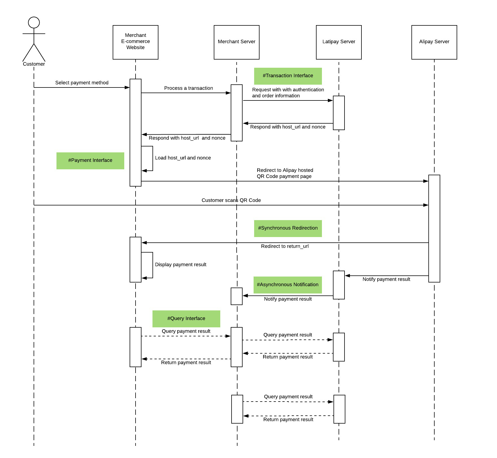
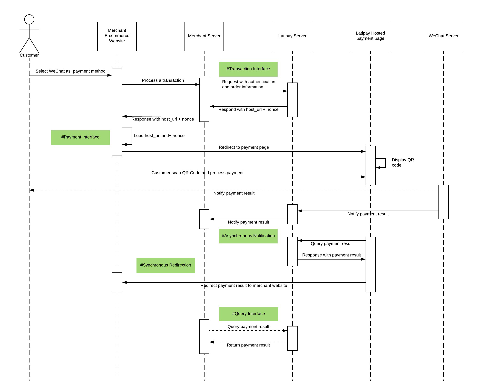
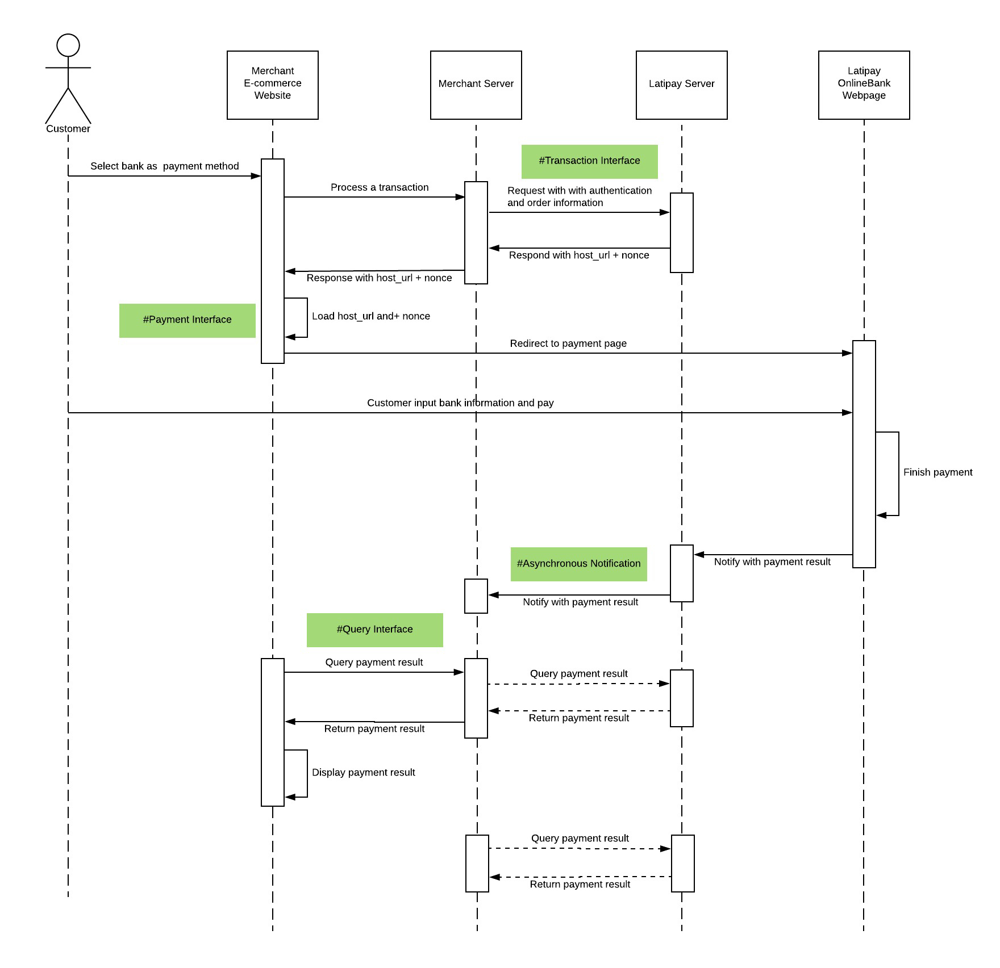
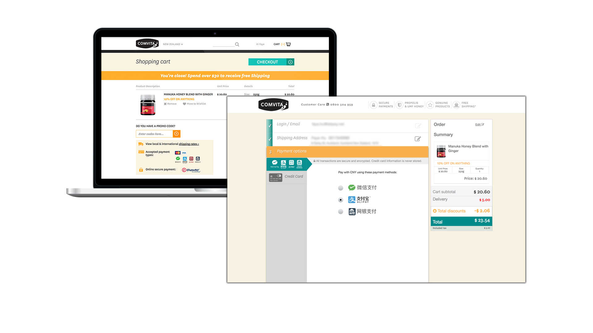
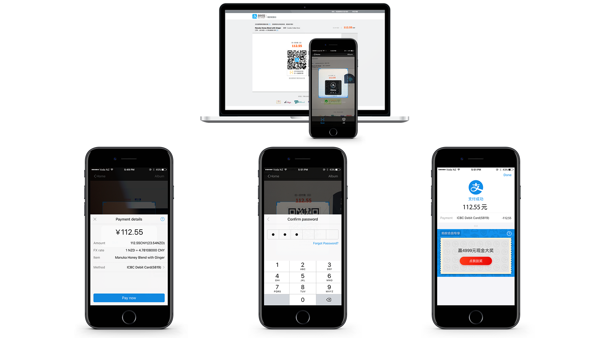
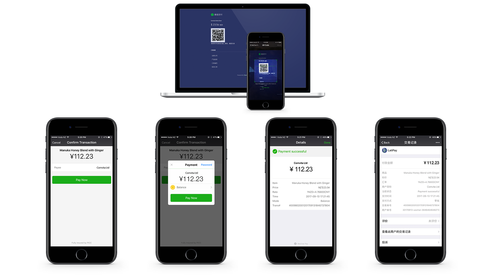
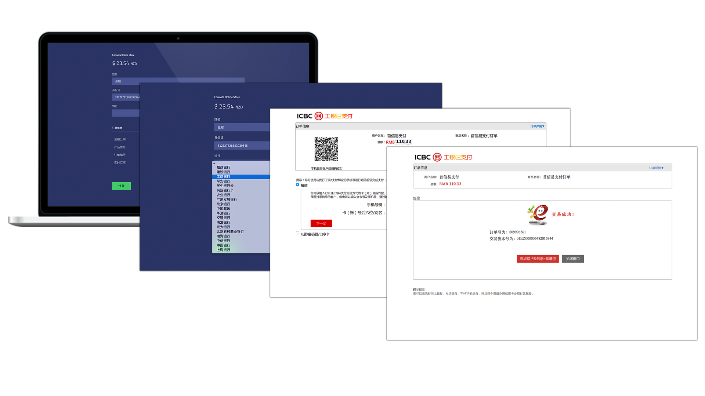
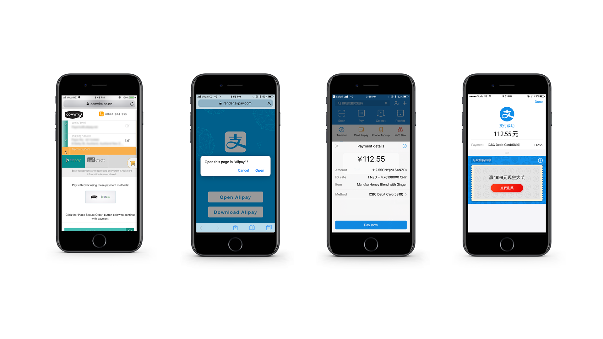
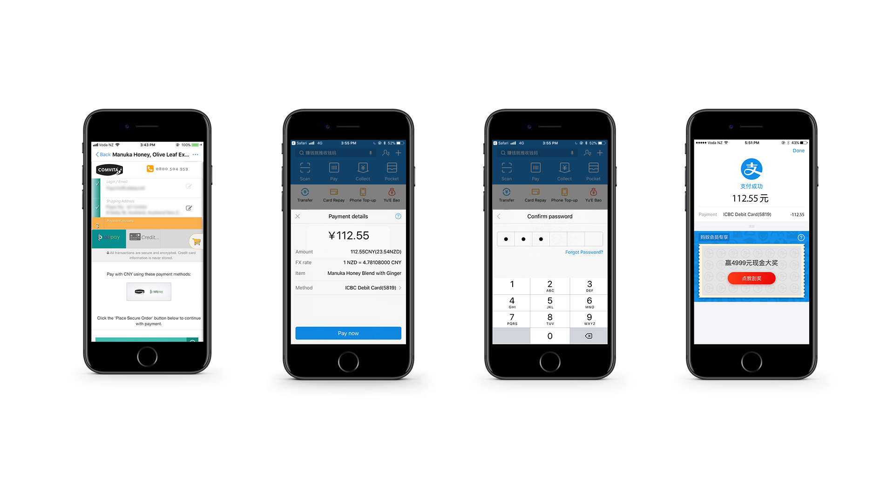
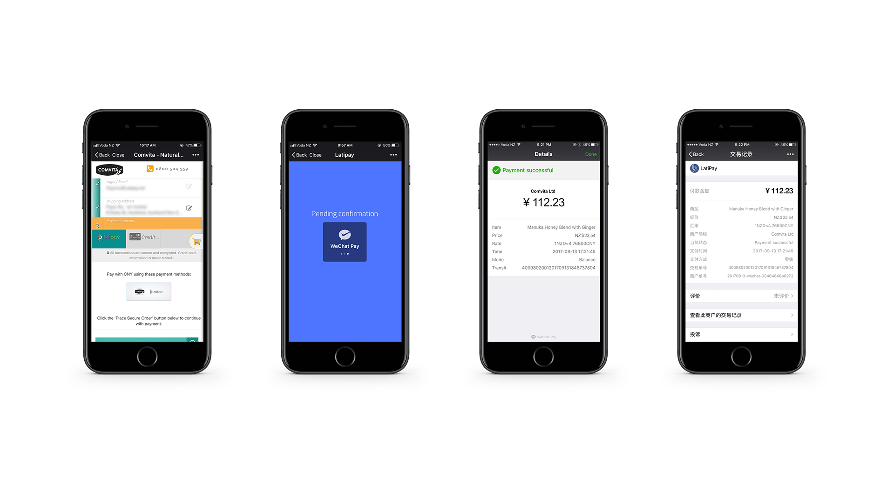

[API Playground]((http://doc.latipay.net/api-console/index.html?api=/v2/transaction))

<p class="tip">Tips: Get your `Wallet ID`, `User ID` and `API key` via <a href="https://merchant.latipay.net/account" target="__blank">Latipay Merchant Portal</a> > Account > Show hidden values
Tips: Create a minimum amount product (e.g. $ 0.01 NZD/AUD) for testing.</p>

## Summary

The Online / E-Commerce API is an independent Hosted Payments Page (HPP) solution provided by Latipay. The HPP provides a solution for capturing WeChat/ Alipay and 19 main Chinese banks information securely without exposing the merchant to sensitive financial data. This Hosted API provides merchants with a secure and versatile solution for online payments and enables payments by redirecting users to a Latipay Hosted Payment Page. A real-time confirmation notification of payment from Latipay will be sent to the merchants in the form of a callback notification. These notifications are handled effectively and sent to an allocated callback_url in less than `30s`. Merchants also can track payment status through the Latipay Order Query API. More available from the Merchant and Transaction portals of Latipay.

** Available Payment Methods **

* Alipay (Alipay website payment page)
* WeChat Pay (Latipay hosted payment page)
* 16 Chinese OnlineBanks (Latipay hosted payment page)

** Relevant Products **

* E-commerce Website

## How it works?

Alipay



---
Wechat


---
OnlineBank

---

## Payment Scenarios

* <strong>The payment scenarios are basing on the customer using Latipay payment services by `PC browser`.</strong>

Merchant website checkout page

---
Alipay


WeChat Pay


Online Bank

---
* <strong>The payment scenario is basing on the customer using Latipay payment services by `Mobile browser`</strong>, Such as Safari in iPhone.

Alipay
The mobile browser Safari will try to launch Alipay app to make the payment. It doesn't support Wechat pay.



---
* <strong>The payment scenario is basing on the customer using Latipay payment services by `Embedded browser in App`.</strong>

Alipay


WeChat Pay


## API Details

### 1 - Latipay Transaction Interface

```
POST https://api.latipay.net/v2/transaction
Content-Type: application/json;charset=UTF-8
```

Demo

```
curl \
-X POST \
-H "Content-Type: application/json;charset=UTF-8" \
-d '{"user_id":"U000334333","wallet_id":"W00000001","amount":"120.00","payment_method":"alipay","return_url":"https://merchantsite.com/checkout","callback_url":"https://merchantsite.com/confirm","signature":"8d1bea078eaacdae8388852851ec39e2e8561cdce64f359421d85ed4844496ec","merchant_reference":"dsi39ej430sks03","ip":"122.122.122.1","version":"2.0","product_name":"Pinot Noir, Otago"}' \
https://api.latipay.net/v2/transaction
```

* <strong>Attributes</strong>

| Name  | Type  | Description | Nullable |
|------------- |---------------| -------------| -------------|
|user_id | String | The Latipay user account which is using for processing the transactions. | NO |
|wallet_id | String | The wallet ID that using for online transactions.  | NO
|payment_method | String | The payment methods can be `wechat`, `alipay` or `onlineBank`. | NO
|amount | String | A decimal amount. | NO
|return_url | String | The URL of the landing page where the customer will be directed to after payment. | NO
|callback_url | String | Merchant webserver's URL that the payment result will send to. | NO
|backPage_url | String | Optional, A back link show on Latipay's payment page. Customer can back to merchant's website with this link. | YES
|merchant_reference | String | A `unique id` identifying the order in Merchant's system. | NO
|ip | String(16) | The customer's IPv4 address | NO
|version | String | The latest version of the Latipay platform which must be `"2.0"` | Yes
|product_name | String | The name of the product or service being sold. | No
|signature | String | The `SHA-256 HMAC` API signature. | NO

#### Extract Attributes (`Only for WeChat`)

| Name  | Type  | Description | Nullable |
|------------- |---------------| -------------| -------------|
| present_qr | String| Must be `"1"`, to show a Latipay hosted page which presenting QR code waiting for scanning. It only works outside of Wechat App, such as PC browser. | NO|

Example

  ```json
  {
    "user_id": "U000334333",
    "wallet_id": "W00000001",
    "amount": "120.00",
    "payment_method": "alipay",
    "return_url": "https://merchantsite.com/checkout",
    "callback_url": "https://merchantsite.com/confirm",
    "merchant_reference": "dsi39ej430sks03",
    "ip": "122.122.122.1",
    "version": "2.0",
    "product_name": "Pinot Noir, Otago",

    "signature": "8d1bea078eaacdae8388852851ec39e2e8561cdce64f359421d85ed4844496ec",
  }
  ```

* <strong>SHA-256 HMAC Signature</strong> [Try your signature online](https://jsfiddle.net/tonnyLTP/wj36tey4/45/)

Rearrange parameters alphabetically (except parameters with value of `null` or `empty` string) and join them with `&`, and concat the value of `api_key` in the end.

JS code example:

```js
  Object.keys(data)
    .filter(item => data[item] != null && data[item] != undefined && data[item] !== '')
    .sort()
    .map(item => `${item}=${data[item]}`)
    .join('&')
    .concat(api_key)
```

Example

```
message: amount=120.00&callback_url=https://merchantsite.com/confirm&ip=122.122.122.1&merchant_reference=dsi39ej430sks03&payment_method=alipay&product_name=Pinot Noir, Otago&return_url=https://merchantsite.com/checkout&user_id=U000334333&version=2.0&wallet_id=W00000001111222333
secret(your api_key): 111222333

signature: 8d1bea078eaacdae8388852851ec39e2e8561cdce64f359421d85ed4844496ec
```

* <strong>Response</strong>

```json
{
  "host_url": "https://pay.latipay.net/pay",
  "nonce": "7d5a88119354301ad3fc250404493bd27abf4467283a061d1ed11860a46e1bf3",
  "signature": "14d5b06a2a5a2ec509a148277ed4cbeb3c43301b239f080a3467ff0aba4070e3",
}
```

| Name  | Type  | Description |
|------------- |---------------| -------------|
| host_url | String | A URL will direct customer to finish the payment.
| nonce | String | The transaction nonce must be appended to the `host_url`. Please make sure it always be fresh, `Do not save it` for using later.
| signature | String | The SHA-256 HMAC API signature.

Signature in Response

<p class="tip">We are highly recommending you to verify the **signature** in merchant's webserver to ensure the security.</p>

```
message: nonce + host_url
secret: api_key
```


### 2 - Latipay Payment Interface

Loading the URI in PC browser, mobile browser or Alipay/ WeChat's embedded browser.
```
{host_url}/{nonce}
```

<p class="tip">If it's PC browser, you can load this url in current window or new window. But if it's mobile browser or  inside of Alipay or Wechat, please load the url in this or similar way: `window.location.href={host_url}/{nonce}`, so the window will be redirected to payment gateway to finish the payment.</p>

Example

```
https://pay.latipay.net/pay/7d5a88119354301ad3fc250404493bd27abf4467283a061d1ed11860a46e1bf3
```

### 3 - Asynchronous Notification

Asynchronous Notification is a re-try mechanism to ensure the notification has been updated to the merchant's web server. There is no times limitation until it returns an indicating `"sent"` text to Latipay. The time interval of this notification is about 30 seconds.

```
POST merchant's callback_url
Content-Type: application/x-www-form-urlencoded
```
<p class="tip">The status of response must be <a href="https://developer.mozilla.org/en-US/docs/Web/HTTP/Status/200">200</a></p>

Attributes

| Name  | Type  | Description |
|------------- |---------------| -------------|
|merchant_reference | String | A `unique id` identifying the order in Merchant's system. | NO
|currency | String | The currency code of the transaction. |
|amount | String | A decimal amount. |
|payment_method | String | The payment methods can be `wechat`, `alipay` or `onlineBank`. |
|status | String | The status of the transaction can be `pending`, `paid`, or `failed`. |
|pay_time | String | The payment time of the transaction processed. Latipay uses `UTC`as default timezone. `UTC/GMT+08:00`|
|signature | String | The `SHA-256 HMAC` API signature. |

Example

```json
{
  "merchant_reference": "dsi39ej430sks03",
  "amount": "120.00",
  "currency": "NZD",
  "payment_method": "alipay",
  "pay_time": "2017-07-07 10:53:50",
  "status" : "paid",

  "signature": "840151e0dc39496e22b410b83058b4ddd633b786936c505ae978fae029a1e0f1",
}
```

SHA-256 HMAC Signature
```
message: merchant_reference + payment_method + status + currency + amount
secret: api_key
```

Example

```
message: dsi39ej430sks03alipaypaidNZD120.00
secret(your api_key): 111222333

signature: 840151e0dc39496e22b410b83058b4ddd633b786936c505ae978fae029a1e0f1
```


### 4 - Synchronous Redirection
<p class="tip">This redirection only happens in Wechat pay's embedded browser and OnlineBank. For Alipay, it only happens in PC browser, not in Alipay app. This api being called does not mean the payment is successful. `Do not relay on the value of status in parameters, you need check it from your own server`</p>

There is a sync and front-end payment result redirection sent from Latipay to merchant after the payment is done.

```
Redirect merchant's return_url
```

| Name  | Type  | Description |
|------------- |---------------| -------------|
|merchant_reference | String | A `unique id` identifying the order in Merchant's system. |
| payment_method | String | The payment methods can be `wechat`, `alipay` or `onlineBank`. |
| status | String | The status of the transaction can be `paid`, or `cancel_or_fail`(only for wechat). |
| currency | String | The currency code of the transaction. |
| amount | String | A decimal amount. |
| signature | String |The `SHA-256 HMAC` API signature.

Example

```
https://www.merchant.com/latipay?merchant_reference=dsi39ej430sks03&payment_method=alipay&status=paid&currency=NZD&amount=100.00&signature= 14d5b06a2a5a2ec509a148277ed4cbeb3c43301b239f080a3467ff0aba4070e3
```

SHA-256 HMAC Signature

Merchant frontend need to validate the signature for protecting against malicious requests.

```
message: merchant_reference + payment_method + status + currency + amount
secret: api_key
```

### 5 - Payment Result Interface
All customers can send requests to query payment status with merchant order id(that should be `unique id` for the merchant) as merchant_reference by HTTP GET request.

```
GET https://api.latipay.net/v2/transaction/{merchant_reference}
```

#### Parameters

| Name  | Type  | Description | Nullable |
|------------- |---------------| -------------| -------------|
| merchant_reference | String | A `unique id` identifying the order in Merchant's system. | NO |
| user_id | String | The user account you want to use to process the transaction. | NO |
| is_block | Int | Optional parameter, `1` means the http request use long poolling mechanism, the timeout is 180s. | YES |
| signature | String | The `SHA-256 HMAC` API signature. | NO |

* <strong>SHA-256 HMAC Signature</strong> [Try your signature online](https://jsfiddle.net/tonnyLTP/wj36tey4/45/)

Rearrange parameters alphabetically (except parameters with value of `null` or `empty` string) and join them with `&`, and concat the value of `api_key` in the end.

JS code example:

```js
  Object.keys(data)
    .filter(item => data[item] != null && data[item] != undefined && data[item] !== '')
    .sort()
    .map(item => `${item}=${data[item]}`)
    .join('&')
    .concat(api_key)
```

```
Message: merchant_reference=6000324&user_id=U000000013111222333
SecretKey: 111222333
Signature: 58f93f458880120d650611f2452917a25a39edc2f5e3a03baac73a7a49bc81f4
```


#### Example

```
GET https://api.latipay.net/v2/transaction/1289323A122DB?user_id=U000334333&signature=14d5b06a2a5a2ec509a148277ed4cbeb3c43301b239f080a3467ff0aba4070e3
```

#### Response

| Name  | Type  | Description |
|------------- |---------------| -------------|
|merchant_reference | String | A `unique id` identifying the order in Merchant's system. |
| currency | String | The currency code of the transaction. |
| amount | String | A decimal amount. |
| payment_method | String | The payment method used. Possible values are alipay and wechat. |
| status | String | The status of the transaction. Possible values are: pending, paid, or failed. |
| pay_time | String | Show the payment time of the transaction order. `UTC/GMT+08:00`|
|order_id|	String|	A unique transaction identifier generated by Latipay.|
| signature | String | The `SHA-256 HMAC` API signature. |

#### Example Response

```json
{
  "merchant_reference": "dsi39ej430sks03",
  "currency": "AUD",
  "amount": "120.00",
  "payment_method": "wechat",
  "status": "paid",
  "pay_time": "2017-07-07 10:53:50",
  "order_id": "201834687346343",

  "signature": "14d5b06a2a5a2ec509a148277ed4cbeb3c43301b239f080a3467ff0aba4070e3",
}
```

#### Signature in Response
For security reasons, we highly recommend you verify the signature in the response.

```
message: merchant_reference + payment_method + status + currency + amount
secret: api_key
```

#### Example Signature

```
message: dsi39ej430sks03alipaypaidNZD120.00
secret(your api_key): 111222333

signature: 840151e0dc39496e22b410b83058b4ddd633b786936c505ae978fae029a1e0f1

```
