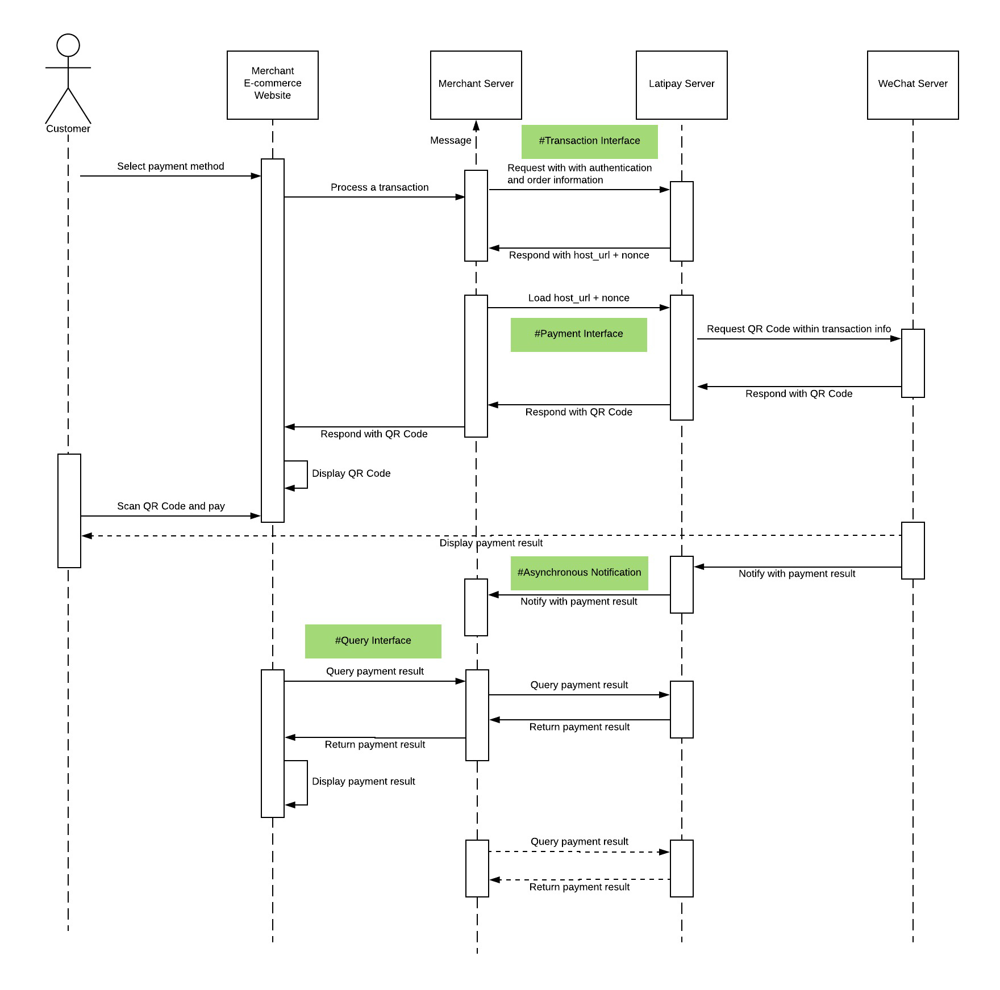
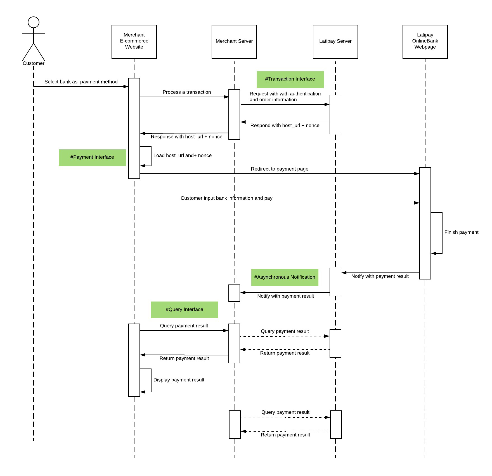

[API Playground](https://pay.latipay.net/api-console-merchant-hosted-online)

<p class="tip">Tips: Get your `Wallet ID`, `User ID` and `API key` via <a href="https://merchant.latipay.net/account" target="__blank">Latipay Merchant Portal</a> > Account > Show hidden values
Tips: Create a minimum amount product (e.g. $ 0.01 NZD/AUD) for testing.</p>

## Summary

Powerful and robust online payment solutions, which work on a range of platforms which include website, billing software and Applications. Latipay provides merchants with the interface for developing custom built WeChat QR Code payment page.

** Available Payment Methods **

* Alipay (Alipay hosted QR Code payment page)
* WeChat Pay (Customised QR Code payment page)
* 16 Chinese OnlineBanks (Latipay hosted payment page)

## How it works?

#### Alipay


#### WeChat



#### Online Bank



## Payment Scenarios

#### Website check-out page


---

#### WeChat Pay


---

#### Alipay


---

#### Online Bank


---

## API Details

### STEP 1 - Latipay Transaction Interface

```
POST https://api.latipay.net/v2/transaction
Content-Type: application/json;charset=UTF-8
```

Demo

```
curl \
-X POST \
-H "Content-Type: application/json;charset=UTF-8" \
-d '{"signature":"a6b2ead2612b3ad51fd33688d4335d55ad426941fcf160745d3a49354224de22","wallet_id":"W00000001","amount":"120.00","user_id":"U000334333","merchant_reference":"dsi39ej430sks03","return_url":"","callback_url":"https://merchantsite.com/confirm","ip":"122.122.122.1","version":"2.0","product_name":"Pinot Noir, Otago","payment_method":"alipay"}' \
https://api.latipay.net/v2/transaction
```

#### Attributes:		


| Name  | Type  | Description | Nullable |
|------------- |---------------| -------------| -------------|
| user_id| String| The user account you want to use to process the transaction.| NO|
| wallet_id| String| The ID of the wallet you want to use.| NO|
| amount| String| A decimal amount.| NO|
| merchant_reference | String | A `unique id` identifying the order in Merchant's system. | NO |
| payment_method| String| Payment method options are `alipay`, `wechat` or `onlineBank`.| NO|
| return_url| String| The URL of the landing page where Latipay will return the customer after payment.| NO|
|callback_url | String | Merchant webserver's URL that the payment result will send to. | NO|
| ip| String| The IP address of the customer.| NO|
| version| String| The latest version of the platform. must be `"2.0"`| NO|
| product_name| String| The name of the product or service being sold.| YES|
| signature| String| The SHA-256 HMAC API signature.| NO|

#### Extract Attributes (`Only for WeChat`):		


| Name  | Type  | Description | Nullable |
|------------- |---------------| -------------| -------------|
| host_type| String|`"1"` is returning `QR code picture` in base64 and `QR code text`, merchant can either display the picture or generate QR code from the text | NO|

#### Example Attributes

```json
{
  "wallet_id": "W00000001",
  "amount": "120.00",
  "user_id": "U000334333",
  "merchant_reference": "dsi39ej430sks03",
  "return_url": "",
  "callback_url": "https://merchantsite.com/confirm",
  "ip": "122.122.122.1",
  "version": "2.0",
  "product_name": "Pinot Noir, Otago",
  "payment_method": "alipay",

  "signature": "a6b2ead2612b3ad51fd33688d4335d55ad426941fcf160745d3a49354224de22",
}
```

#### SHA-256 HMAC Signature

JS code example:

```js
  Object.keys(data)
    .filter(item => data[item] != null && data[item] != undefined && data[item] !== '')
    .sort()
    .map(item => `${item}=${data[item]}`)
    .join('&')
    .concat(api_key)
```
Example [Try your signature online](https://www.freeformatter.com/hmac-generator.html)

```
message: amount=120.00&callback_url=https://merchantsite.com/confirm&ip=122.122.122.1&merchant_reference=dsi39ej430sks03&payment_method=alipay&product_name=Pinot Noir, Otago&user_id=U000334333&version=2.0&wallet_id=W00000001111222333
secret(your api_key): 111222333

signature: a6b2ead2612b3ad51fd33688d4335d55ad426941fcf160745d3a49354224de22
```

#### Response

```json
{
  "host_url": "https://api.latipay.net/v2/merchanthosted/gatewaydata",
  "nonce": "7d5a88119354301ad3fc250404493bd27abf4467283a061d1ed11860a46e1bf3",
  "signature": "14d5b06a2a5a2ec509a148277ed4cbeb3c43301b239f080a3467ff0aba4070e3",
}
```

| Name  | Type  | Description |
|------------- |---------------| -------------|
|host_url | String | The url for request a QR code picture. The nonce should be appended to the end. |
|nonce | String | The transaction nonce must be appended to the host_url URL. |
|signature | String | The SHA-256 HMAC API signature. |


#### Signature in Response
For security reasons, we highly recommend you verify the signature in the response.

```
message: nonce + host_url
secret: api_key
```

### STEP 2 - Latipay Payment Interface

For Alipay, load the api in PC browser, mobile browser or Alipay's embedded browser. For Wechat, send the GET request for retrieving QR code.

```
{host_url}/{nonce}
```

#### Example

```
https://api.latipay.net/v2/merchanthosted/gatewaydata/7d5a88119354301ad3fc250404493bd27abf4467283a061d1ed11860a46e1bf3
```
<p class="tip">`Alipay` payment is directly going to Alipay payment page. `Online Bank` payment is directly going to Banks payment page. But `Wechat` payment will response as below. </p>

* Response (`Only for WeChat`)

| Name  | Type  | Description |
|------------- |---------------| -------------|
|code | Integer | The response code of payment, `0` or [Error Code](https://doc.latipay.net/v2/error-code.html), 0 means no error happened.
|message | String | The response message of payment interface.
|data | Object | Contains `QR code picture` or text and order information.

* the `data` object

| Name  | Type  | Description |
|------------- |---------------| -------------|
| order_id | String | A unique transaction identifier generated by Latipay. |
| nonce | String | A unique transaction nonce generated by Latipay. |
| payment_method | String | Payment method options are alipay and wechat. |
| amount | String | A decimal amount. |
| amount_cny | String | A decimal amount. |
| currency | String | The currency code of the transaction. |
| product_name | String | The name of the product or service being sold. |
|organisation_id | Integer | The merchant id which is used to process the transaction. |
|organisation_name | String | The merchant's name |
|user_id | String | The user account which is used to process the transaction. |
|user_name | String | The user account's name |
|wallet_id | String | The user wallet account which is used to process the transaction. |
|wallet_name | String | The wallet account's name |
|qr_code | String | The QR code picture |
|qr_code_url | String | The QR code text version, you can generate QR code picture with it. |
|currency_rate | String | The rate which is used to the transaction. |
| merchant_reference | String | A `unique id` identifying the order in Merchant's system. |
|signature | String | The `SHA-256 HMAC` API signature. |

#### Example

```json
{
    "code": 0,
    "message": "SUCCESS",
    "data": {
      order_id: "20180411000011",
      nonce: "9cbd6620180411115539ca7260dd01f54c5f8977b262256828",
      payment_method: "wechat",
      amount: 0.02,
      amount_cny: 0.09,
      currency: "NZD",
      product_name: "food",
      organisation_id: 1,
      organisation_name: "123123",
      user_id: "U00001534",
      user_name: "abcdefghijklmnopqrstuvwxyz",
      wallet_id: "W00000001",
      wallet_name: "test account",
      qr_code: "data:image/png;base64,iVBORw0KGgoAAAANSUhEUgAAAMgAAADICAYAAACtWK6eAAAEz0lEQVR42u3dSW7kMBAEQP3/0zMvMGDAVGUWFQX4JnWLS/QhTZHPP6XUj/XoAqUAUQoQpQBRChClAFFqN5DneWr+ft2gX957+jtS7f3T4P/hWSbubehnQAABBBBAAAEEEEAAAQSQaiCpgWvC0DQpT1+3sU/f/F5AAAEEEEAAAQQQQAABBJB1QE6nCKmJkEphUm3b+AM4jRoQQAABBBBAAAEEEEAAAQSQoiULt6R2qcQKEEAAAQQQQAABBBBAAAEEECnWeLVPttNLTQABBBBAAAEEEEAAAQQQQAApBbKxA1ObNmzs56Z7p9sLCCCAAAIIIIAAAggggABSDaRpBzzX3XOdrUcBcR0ggLgOEEBcBwggrgPEGYWvJiRN6Vlqk4r142pqAwIIIIAAAggggAACCCDbgHztvL+mSbkxTdo0DwABBBBAAAEEEEAAAQQQQKqBpDYJ2PjuQqptN2+iMf0sgAACCCCAAAIIIIAAAggg1UAmGpJaopH6vFSCmJqUre9+AAIIIIAAAggggAACCCCAXLvUpH0pwvaBa0zA2tOu2KYNgAACCCCAAAIIIIAAAggg6Z0Vmz4vVamE7nRfpb4j1VeAAAIIIIAAAggggAACCCCVQCZSk4lUoimFaV8y0778pD7mBQQQQAABBBBAAAEEEEAAmfxP+sbOP31veztuhl4f8wICCCCAAAIIIIAAAggggLwFJJWutKNpOnswNXk3vicDCCCAAAIIIIAAAggggACyGsjXNjto3xgiNWFS49awwQUggAACCCCAAAIIIIAAAkgNkKZlJam062s7PzalihOfBwgggAACCCCAAAIIIIAAAshw4pJCfQv+dqxXp1iAAAIIIIAAAggggAACCCCNE/r0IE0kVqfvnYAkUQMEEEAAAQQQQAABBBBAAPkwkBSajUCa2pZKnaafDxBAAAEEEEAAAQQQQAABpBrIjbvnfXXin/5xak8aAQEEEEAAAQQQQAABBBBAVgNp3wr/FphN4E4/88S9gAACCCCAAAIIIIAAAggggCzfPOHmnQYtmQmeUQgIIIAAAggggAACCCCAAJI+J70d19feo2gao6Z2AAIIIIAAAggggAACCCCArAbSkCK8NcCpH4SmJSRNk7w1LQQEEEAAAQQQQAABBBBAALninfSJTmhK3ibQbDzuYQJmVcwLCCCAAAIIIIAAAggggAAy+Z/09gndlJDckrK1Tt6JZAsQQAABBBBAAAEEEEAAAaQGSKpxTQlO0w9He9tuSe0AAQQQQAABBBBAAAEEEEAqgbRX+yC1p063nG/4ZoIICCCAAAIIIIAAAggggACy7viDW84o/Np7KE2TN5XGAQIIIIAAAggggAACCCCArAaSSqcmAKcSpo2bNrSnWKeeDxBAAAEEEEAAAQQQQAABZB2Qje9qtA7I5GRrTy4bkjxAAAEEEEAAAQQQQAABBBBASnfZO9H5E+8zNG3asL0PAAEEEEAAAQQQQAABBBBAAAl1YKq9pyflxLOkEjApFiCAAAIIIIAAAggggAACSOn7IE0T6+ZjF96cgO2fBwgggAACCCCAAAIIIIAAUg3k5mMDvrYBQtP3NqWjgAACCCCAAAIIIIAAAgggzklXqrAAUQoQpQBRChClAFEKEKUAUWp1/Qf6j3VUKG0J3AAAAABJRU5ErkJggg==",
      qr_code_url: "weixin://wxpay/bizpayurl?pr=hmU9BXs",
      currency_rate: "4.64490",
      merchant_reference: "M00001543-000001",
      signature: "15e8f83c0e3cddbec01b0ee135d958d872d21498bd29ff6defc2eb2f11b11108"
    }
}
```

#### SHA-256 HMAC Signature
Rearrange parameters in the `data` alphabetically (except `signature` and other parameters with value of `null` or `empty` string) and join rearranged parameters with `&`, and concat the value of `api_key` in the end.

```
message: amount=0.02&amount_cny=0.09&currency=NZD&currency_rate=4.65776&merchant_reference=M00001543-000001&nonce=41226220180411114422fdfdba5d94f84fdc873f0f9ea6d5a6&order_id=20180411000009&organisation_id=1&organisation_name=123123&payment_method=alipay&product_name=food&qr_code=data:image/png;base64,iVBORw0KGgoAAAANSUhEUgAAAMgAAADICAYAAACtWK6eAAAE+klEQVR42u3dQW7jMBAEQP//07v3BfYQmNPTZKqBnJzYscQSMKQ0/PwRkf/m4xCIACICiAggIoCIACICiAggIoCIACIigIgAIgKICCAigIgAIgKICCD/vtHnE/05/f/+9Pv89P2+/f3T3+/03397PNvGByCAAAIIIIAAAggg9wFJn/BtUNsD8NsB+e3xvv2CAAgggAACCCCAAALIe0CmT1j7ADkNenuAbhfxgAACCCCAAAIIIIAA0n4Atv/+NMBpoOkLCiCAAAIIIIAAAggggPy2Ij19s93p4337zY+AAAIIIIAAAggggACyXcROF63TA3wa3PT3a1tY3Rp/gAACCCCAAAIIIIBo2pBaqPL67kKgriaAAAIIIF4HBBCvA9KeaVDt4LcXYl8NIIAAAggggAACCCDvAkkXZW2ATg/A0zdjTi/MtiwMAgIIIIAAAggggAByL5DtInEaQBpk+viePv/bF0RAAAEEEEAAAQQQQN4Dkm6C0Dag25tKpH9/e7wAAggggAACCCCAAPI+kJaFnVsWLrebRmxPgqQXFgEBBBBAAAEEEEAAAWT679tvfnxtEmH689culIAAAggggAACCCCA1AJpazJwWzPlNLDp85e+4AECCCCAAAIIIIAAAsjpL9y2aabXsxfIX7eJJyCAAAKI1wEBxOuAxBcGv/287Y3r0xeA228Grf0/AQEEEEAAAQQQQAB5BkjbwlJ7E4Pf1ljv13VWBAQQQAABBBBAAAFkvUg+/XntRWNbU4b0Ba91UgIQQAABBBBAAAEEkHuK9OkT2tYE4bYHxtomWQABBBBAAAEEEEAAASRdtKeLzOmf05MY6aK+vYgGBBBAAAEEEEAAAQSQ9EP96fe/rUje3nQzPUkCCCCAAAIIIIAAAggg7QtR20VqGnS6SG5b+AQEEEAAAQQQQAABBJDp5sSvbZo5/XnTx7N9UgQQQAABBBBAAAEEkPuBtC2UtU06tB+v9g1vnu9qAggggAACCCCAAAJIHND2A0zpB4TaN8RpWzi9rkgHBBBAAAEEEEAAASS+UNi+0JYu0tMLd6813otdGAABBBBAAAEEEEAAeQZIe/Pjtg2B0jd3pic1dDUBBBBAAAEEEEAAASS9kHS6KGsrOqcXHtsmOdrOJyCAAAIIIIAAAggg7wGZPiC3NyrbbizX3vy7tVEeIIAAAggggAACCCD3FumnQW1vIDMN+jbwbRcYQAABBBBAAAEEEEDeBzJeLIWLtNuaNrQ9kHYa1FYRDwgggAACCCCAAALIO43j0kXibQ/4bDfKay2a4xdmQAABBBBAAAEEEEBqgUwfsLYB2lbUbw/g9g13AAEEEEAAAQQQQAB5D8h6MRV+QCj9/0xPgrRtIAQIIIAAAggggAACCCDpA9w2wNo3DW1buEwfX0AAAQQQQAABBBBAAJkuwr/9/O0HoNJNGbbPz/QFChBAAAEEEEAAAQQQQNqKvOmitb2oTy/MvnLzIiCAAAIIIIAAAggggLQ0fZieVGhritAODhBAAAEEEEAAAQQQQNqAbDeVuH3Ty9smAQABBBBAAAEEEEAAAST9/rdvInp7E4fpSYvY5AQggAACCCCAAAIIINcASd+8Nl10pl+/rfHd6fGxPUkACCCAAAIIIIAAAkg/EJEXA4gIICKAiAAiAogIICKAiAAiAogIICICiAggIoCIACICiAggIoCIPJO/H7l2LoSyTzgAAAAASUVORK5CYII=&qr_code_url=https://qr.alipay.com/bax08151zdenrj3nltzi80a9&user_id=U00001534&user_name=abcdefghijklmnopqrstuvwxyz&wallet_id=W00000001&wallet_name=test accountXXXXXXXXX
secret(your api_key): XXXXXXXXX
```

JS code example:

```js
  Object.keys(data)
    .filter(item => item !== 'signature')
    .sort()
    .map(item => `${item}=${data[item]}`)
    .join('&')
    .concat('XXXXXXXXX')
```

### STEP 3 - Payment Result Asynchronous Notification

This is a payment result notification sent by Latipay to merchants after the payment is done successfully. There is a re-try mechanism with the notification to ensure the notification could be delivered to the merchant.


```
POST merchant's callback_url
Content-Type: application/x-www-form-urlencoded
```

#### Attributes:		

| Name  | Type  | Description |
|------------- |---------------| -------------|
| merchant_reference | String | A `unique id` identifying the order in Merchant's system. |
| currency | String | The currency code of the transaction. |
| amount | String | A decimal amount. |
| payment_method | String | The payment method used. Possible values are alipay and wechat. |
| status | String | The status of the transaction. Possible values are: pending, paid, or failed. |
| pay_time | String | Show the payment time of the transaction order. |
| signature | String | The `SHA-256 HMAC` API signature. |  

#### Example input

```json
{
  "merchant_reference": "dsi39ej430sks03",
  "currency": "AUD",
  "amount": "120.00",
  "payment_method": "wechat",
  "status": "paid",
  "pay_time": "2017-07-07 10:53:50",

  "signature": "14d5b06a2a5a2ec509a148277ed4cbeb3c43301b239f080a3467ff0aba4070e3"
}
```


#### SHA-256 HMAC Signature
Merchant backend needs to validate the signature for protecting against malicious requests.

```
message: merchant_reference + payment_method + status + currency + amount
secret: api_key
```

#### Expected the text "sent" in Response's body

```
sent
```

### STEP 4 - Synchronous Redirection
<p class="tip">This redirection only happens in Wechat pay's embedded browser and OnlineBank. For Alipay, it only happens in PC browser, not in Alipay app.</p>

There is a sync and front-end payment result redirection sent from Latipay to merchant after the payment is done successfully.

```
Redirect merchant's return_url
```

| Name  | Type  | Description |
|------------- |---------------| -------------|
| merchant_reference | String | A `unique id` identifying the order in Merchant's system. |
| payment_method | String | The payment methods can be `wechat`, `alipay` or `onlineBank`. |
| status | String | The status of the transaction can be `pending`, `paid`, or `failed`. |
| currency | String | The currency code of the transaction. |
| amount | String | A decimal amount. |
| signature | String |The `SHA-256 HMAC` API signature.

Example

```
https://www.merchant.com/latipay?merchant_reference=dsi39ej430sks03&payment_method=alipay&status=paid&currency=NZD&amount=100.00&signature= 14d5b06a2a5a2ec509a148277ed4cbeb3c43301b239f080a3467ff0aba4070e3
```

SHA-256 HMAC Signature

Merchant frontend need to validate the signature for protecting against malicious requests.

```
message: merchant_reference + payment_method + status + currency + amount
secret: api_key
```

### STEP 5 - Payment Result Interface
All customers can send requests to query payment status with merchant order id(that should be `unique id` for the merchant) as merchant_reference by HTTP GET request.

```
GET https://api.latipay.net/v2/transaction/{merchant_reference}
```

#### Attributes

| Name  | Type  | Description |
|------------- |---------------| -------------|
| user_id | String | The user account you want to use to process the transaction. |
| signature | String | The `SHA-256 HMAC` API signature. |

#### SHA-256 HMAC Signature [Try your signature online](https://www.freeformatter.com/hmac-generator.html)

```
message: merchant_reference + user_id
secret: api_key
```

#### Example

```
GET https://api.latipay.net/v2/transaction/1289323A122DB?user_id=U000334333&signature=14d5b06a2a5a2ec509a148277ed4cbeb3c43301b239f080a3467ff0aba4070e3
```

#### Response

| Name  | Type  | Description |
|------------- |---------------| -------------|
| merchant_reference | String | A `unique id` identifying the order in Merchant's system. |
| currency | String | The currency code of the transaction. |
| amount | String | A decimal amount. |
| payment_method | String | The payment method used. Possible values are alipay and wechat. |
| status | String | The status of the transaction. Possible values are: pending, paid, or failed. |
| pay_time | String | Show the payment time of the transaction order. `UTC/GMT+08:00`|
| signature | String | The `SHA-256 HMAC` API signature. |

#### Example Response

```json
{
  "merchant_reference": "dsi39ej430sks03",
  "currency": "AUD",
  "amount": "120.00",
  "payment_method": "wechat",
  "status": "paid",
  "pay_time": "2017-07-07 10:53:50",

  "signature": "14d5b06a2a5a2ec509a148277ed4cbeb3c43301b239f080a3467ff0aba4070e3",
}
```

#### Signature in Response
For security reasons, we highly recommend you verify the signature in the response.

```
message: merchant_reference + payment_method + status + currency + amount
secret: api_key
```

#### Example Signature [Try your signature online](https://www.freeformatter.com/hmac-generator.html)

```
message: dsi39ej430sks03alipaypaidNZD120.00
secret(your api_key): 111222333
signature: 840151e0dc39496e22b410b83058b4ddd633b786936c505ae978fae029a1e0f1
```
