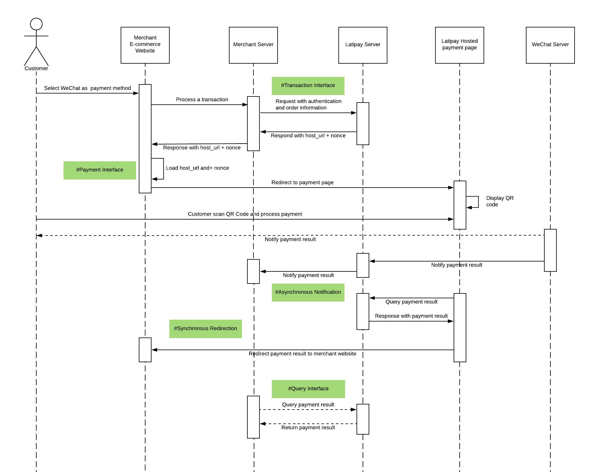

[在线测试API](http://doc.latipay.net/api-console/online.html)

<p class="tip">1. 集成Latipay API需要提前准备好Wallet ID, User ID 和 API key。 <a href="https://merchant.latipay.net/account" target="__blank">Latipay Merchant Portal</a> > Account > Show hidden values；
2. 对应的Wallet ID需要事先开通alipay，wechat或者onlineBank权限；
3. 请勿泄漏api_key；
4. 测试时可以支付最小金额$0.01。</p>

## 支持的支付方式

* 支付宝
* 微信支付
* 人民币银行（16家）

## 支付流程图

支付宝


---
微信


---
人民币银行卡

---

## 支付场景

#### 支付宝


---

#### 微信


---

#### 在线银行


---

#### 电商网站


## 接口列表

### 1. 下单
```
POST https://api.latipay.net/v2/transaction
Content-Type: application/json;charset=UTF-8
```

[在线测试API](http://doc.latipay.net/api-console/online.html?api=/v2/transaction)

Demo

```
curl \
-X POST \
-H "Content-Type: application/json;charset=UTF-8" \
-d '{"user_id":"U000334333","wallet_id":"W00000001","amount":"120.00","payment_method":"alipay","return_url":"https://merchantsite.com/checkout","callback_url":"https://merchantsite.com/confirm","signature":"14d5b06a2a5a2ec509a148277ed4cbeb3c43301b239f080a3467ff0aba4070e3","merchant_reference":"dsi39ej430sks03","ip":"122.122.122.1","version":"2.0","product_name":"Pinot Noir, Otago"}' \
https://api.latipay.net/v2/transaction
```

#### 参数

| 字段  | 类型  | 描述 | 可选 |
|------------- |---------------| -------------| -------------|
| user_id | String | 商户账号用户 id | No |
|wallet_id | String | 商户账号wallet id | No
|payment_method | String | 支付方式 `wechat`, `alipay`, `onlineBank`, or `unionpay` | No
|amount | String | 支付金额 | No
|return_url | String | 支付完成后浏览器继续加载的地址 | No
|callback_url | String | 支付完成后异步通知地址 | No
|backPage_url | String | 如果有此参数，支付页面上会显示该链接：“<取消订单并返回”，顾客点击该链接，返回商户网站 | YES
|signature | String | 参数签名，算法为SHA-256 HMAC | No
|merchant_reference | String | 商户订单号 | No
|ip | String | 客户端ip | No
|version | String | 版本号 `"2.0"` | No
|product_name | String | 订单产品标题 | No

#### 微信的额外参数

| 参数  | 结果 |
| -------------| ------| ------
| present\_qr = "1" | 使用该参数可以获取一个支持微信扫码支付的网页 |

#### 参数例子

```json
{
  "user_id": "U000334333",
  "wallet_id": "W00000001",
  "amount": "120.00",
  "payment_method": "alipay",
  "return_url": "https://merchantsite.com/checkout",
  "callback_url": "https://merchantsite.com/confirm",
  "signature": "14d5b06a2a5a2ec509a148277ed4cbeb3c43301b239f080a3467ff0aba4070e3",
  "merchant_reference": "dsi39ej430sks03",
  "ip": "122.122.122.1",
  "version": "2.0",
  "product_name": "Pinot Noir, Otago"
}
```

#### 参数 SHA-256 HMAC 签名

将所有参数按字母表顺序从小到大排序（去掉其中值为null和空字符串的项），然后以key=value和&形式拼接，最后加上api_key

JS代码
```
Object.keys(data)
  .filter(item => data[item] != null && data[item] != undefined && data[item] !== '')
  .sort()
  .map(item => `${item}=${data[item]}`)
  .join('&')
  .concat(api_key)
```

#### 签名例子

```
待签名文本: amount=120.00&callback_url=https://merchantsite.com/confirm&ip=122.122.122.1&merchant_reference=dsi39ej430sks03&payment_method=alipay&product_name=Pinot Noir, Otago&return_url=https://merchantsite.com/checkout&user_id=U000334333&version=2.0&wallet_id=W00000001111222333
密钥: 111222333

签名结果: 8d1bea078eaacdae8388852851ec39e2e8561cdce64f359421d85ed4844496ec
```

#### 请求结果

```json
{
  "code": 0,
  "message": "SUCCESS",
  "host_url": "https://pay.latipay.net/pay",
  "nonce": "7d5a88119354301ad3fc250404493bd27abf4467283a061d1ed11860a46e1bf3",
  "signature": "14d5b06a2a5a2ec509a148277ed4cbeb3c43301b239f080a3467ff0aba4070e3",
}
```

| 字段  | 类型  | 描述 |
|------------- |---------------| -------------|
|code	| 	Int	| 	0 代表成功
|host_url	| 	String	| 	供浏览器加载的url，使用url和nonce可以完成下一步支付
|nonce	| 	String	| 	订单的临时编号。每次付款都应该调用本接口来保证nonce是最新的，永远不要存储此nonce
|signature	| String	| 服务器端签名，算法为SHA-256 HMAC


#### signature 服务器端签名
服务器端返回结果前，会对nonce + host_url加密，商户端需要进行验证，以保证该请求的合法性

```
待签名文本: nonce + host_url
密钥: api_key
```

### 2. 支付

加载以下地址继续支付订单

```
{host_url}/{nonce}
```

#### 例子

```
https://pay.latipay.net/pay/7d5a88119354301ad3fc250404493bd27abf4467283a061d1ed11860a46e1bf3
```

#### 不同参数，不同平台下支付方式会有差别

|  场景 | 支付方式  | 额外参数  | 结果
|------------- |---------------| -------------| ------| ------
| PC浏览器 |alipay |     |   跳转到支付宝二维码收银台网页|
| 手机浏览器 |alipay |     |   唤醒支付宝app完成支付|
| 支付宝内浏览器 |alipay |     |   支付宝app直接支付|
| 微信内浏览器 |wechat  | | 微信支付 |
|  |wechat  | present\_qr = "1" | 跳转到一个支持微信扫码支付的网页|
|  |onlineBank | 	| 跳转到一个支持输入银行卡信息的网页 |


### 3. 支付结果异步通知
此接口为商户端后台提供，在支付完成后，Latipay服务器每隔30秒调用该接口，直到收到`sent`文本，在调用该接口时，Latipay会传入支付结果信息。

```
POST 商户端的 callback_url
Content-Type: application/x-www-form-urlencoded
```

<p class="tip">返回的请求头状态必须为 <a href="https://developer.mozilla.org/en-US/docs/Web/HTTP/Status/200">200</a>，请求的body必须是文本：`sent`</p>


#### 参数


| 字段  | 类型  | 描述 |
|------------- |---------------| -------------|
|merchant_reference | String | 商户订单id |
|order_id|	String|	Latipay交易id|
|currency | String | 支付币种 |
|amount | String | 支付金额 |
|payment_method | String | 支付方式 |
|status | String | 支付状态，值可能为: pending, paid, 或 failed. |
|pay_time  | String  | 支付时间，北京时间 `UTC/GMT+08:00`|
|signature | String | 参数签名，算法为SHA-256 HMAC |  

#### 参数例子

``` json
{
  "merchant_reference": "dsi39ej430sks03",
  "order_id": "2017232323345671",
  "amount": "120.00",
  "currency": "NZD",
  "payment_method": "alipay",
  "pay_time": "2017-07-07 10:53:50",
  "status" : "paid",

  "signature": "14d5b06a2a5a2ec509a148277ed4cbeb3c43301b239f080a3467ff0aba4070e3",
}
```

#### SHA-256 HMAC签名
商户端后台需要验证该签名

```
待签名文本: merchant_reference + payment_method + status + currency + amount
密钥: api_key
```

#### 结果
Latipay服务器期望收到此文本

```
sent
```

### 4. 支付完成后（成功或失败）浏览器重定向
<p class="tip">此功能仅支持PC浏览器或者微信支付。支付宝App扫码支付成功后，支付宝App并不会跳转。此接口被调用并不意味着支付就成功，安全起见，您需要再通过服务器查询Latipay的订单状态。</p>

客户端支付完成后，会跳转到return_url，并传入以下参数


| 字段 | 类型  | 描述 |
|------------- |---------------| -------------|
|merchant_reference | String | 商户订单id |
|payment_method | String | 支付方式，可能值：alipay, wechat, onlineBank |
|status | String | 支付状态，可能值: pending, paid, 或 failed |
|currency | String | 支付币种 |
|amount | String | 支付金额 |
|signature | String	|服务器端签名，算法为SHA-256 HMAC

#### 例子

```
https://www.merchant.com/latipay?merchant_reference=dsi39ej430sks03&payment_method=alipay&status=paid&currency=NZD&amount=100.00&signature=14d5b06a2a5a2ec509a148277ed4cbeb3c43301b239f080a3467ff0aba4070e3
```

#### 服务器端 SHA-256 HMAC 签名
商户端前端可以考虑验证该签名

```
待签名文本: merchant_reference + payment_method + status + currency + amount
密钥: api_key
```


### 5. 查询支付
向Latipay服务器查询订单支付信息，merchant_reference为商户端订单id。

```
GET https://api.latipay.net/v2/transaction/{merchant_reference}
```

[在线测试API](http://doc.latipay.net/api-console/online.html?api=/v2/transaction/{merchant_reference})

#### 参数
| 字段  | 类型  | 描述 |
|------------- |---------------| -------------|
|user_id | String | 商户账号用户 id |
|signature | String	|参数签名，算法为SHA-256 HMAC

#### SHA-256 HMAC 签名

```
待签名文本: merchant_reference + user_id
密钥: api_key
```

#### 结果

| 字段  | 类型  | 描述 |
|------------- |---------------| -------------|
|merchant_reference  | String  | 商户订单id  |
|currency  | String  | 支付币种  |
|amount  | Number  | 支付金额  |
|payment_method  | String  | 支付方式，可能值：alipay, wechat, onlineBank  |
|status  | String  | 支付状态，可能值: pending, paid, 或 failed  |
|pay_time  | String  | 支付时间，北京时间 `UTC/GMT+08:00`|
|order_id  | String  | Latiapy系统内的唯一支付单号|
|signature  | String  | 服务器端签名，算法为SHA-256 HMAC  |

#### 参数例子

``` json
{
  "signature": "14d5b06a2a5a2ec509a148277ed4cbeb3c43301b239f080a3467ff0aba4070e3",
  "merchant_reference": "dsi39ej430sks03",
  "currency": "AUD",
  "amount": 120.00,
  "payment_method": "wechat",
  "status": "paid",
  "pay_time": "2017-07-07 10:53:50",
  "order_id": "2018327230129"
}
```

#### signature 服务器端签名
服务器端返回结果前会对支付结果加密，商户端需要进行验证，以保证该请求的合法性。

```
加密文本: merchant_reference + payment_method + status + currency + amount
密钥: api_key
```
